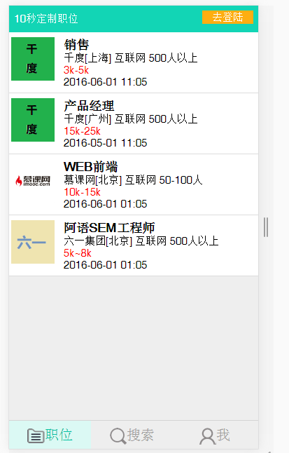

# Angular.js-APP
一个AngularJs编写的WebApp项目, 使用了自动化构建工具Gulp. 内容为招聘网站. 有职位列表页,职位详情页,公司详情页,搜索页,用户页,投递记录页,收藏页,登录页,注册页

1. 先安装 package.json 中的node模块

2. 可能需要全局安装 gulp，即 npm i -g gulp

3. 需要全局安装bower,即 npm i -g bower 
 
4. 然后安装 bower.json 中的依赖模块, 即 bower install 

5. 开发时需要启动 gulp 任务,监听代码并事实行编译
   cmd 进入代码所在目录, gulp serve 启动任务

6. src目录中的 data 文件夹为假数据，直接放置到项目的 src 目录即可。

5. 浏览器输入http://localhost:3000/ 端口可在gulpfile.js中修改
